<div align="center">



<br>


<br>


<a href="https://github.com/SDcold?tab=followers"></a>


</div>

## `$ whoami`

```console
> Full-stack engineer based in Cameroon, building web platforms,
> APIs and desktop tools.
> I work end-to-end: UI in React/Next.js, services in Python/Django & Node,
> and native apps in Qt/QML — then I ship them.
>
> Currently  ::  Wanzo (web + admin + backend) · FULLUPHUB (ATS) · NAYEE
> Daily      ::  Linux · Hyprland · Neovim-adjacent tooling · way too much coffee
> Interests  ::  developer experience, clean architecture, African tech products
> Open to    ::  freelance, open-source, and interesting technical problems
```


## `$ cat stack.json`

<div align="center">

**`frontend`**


**`backend`**


**`data & infra`**


**`desktop & tooling`**


</div>


## `$ ls ~/projects`

<div align="center">

<a href="https://github.com/SDcold/Wanzo-web-app">
  
</a>
<a href="https://github.com/SDcold/backend-wanzo-app">
  
</a>
<a href="https://github.com/SDcold/FULLUPHUB">
  
</a>
<a href="https://github.com/SDcold/end4-pC">
  
</a>

</div>


## `$ git log --stat`

<div align="center">


<br><br>


</div>


## `$ ./contributions --graph`

<div align="center">


<br>

<picture>
  <source media="(prefers-color-scheme: dark)" srcset="https://raw.githubusercontent.com/SDcold/SDcold/output/snake-dark.svg">
  <source media="(prefers-color-scheme: light)" srcset="https://raw.githubusercontent.com/SDcold/SDcold/output/snake.svg">
  
</picture>

</div>


## `$ curl -X POST /connect`

<div align="center">

<a href="mailto:talosamuel36@gmail.com"></a>
<a href="https://github.com/SDcold"></a>

</div>

<br>

<div align="center">


</div>
